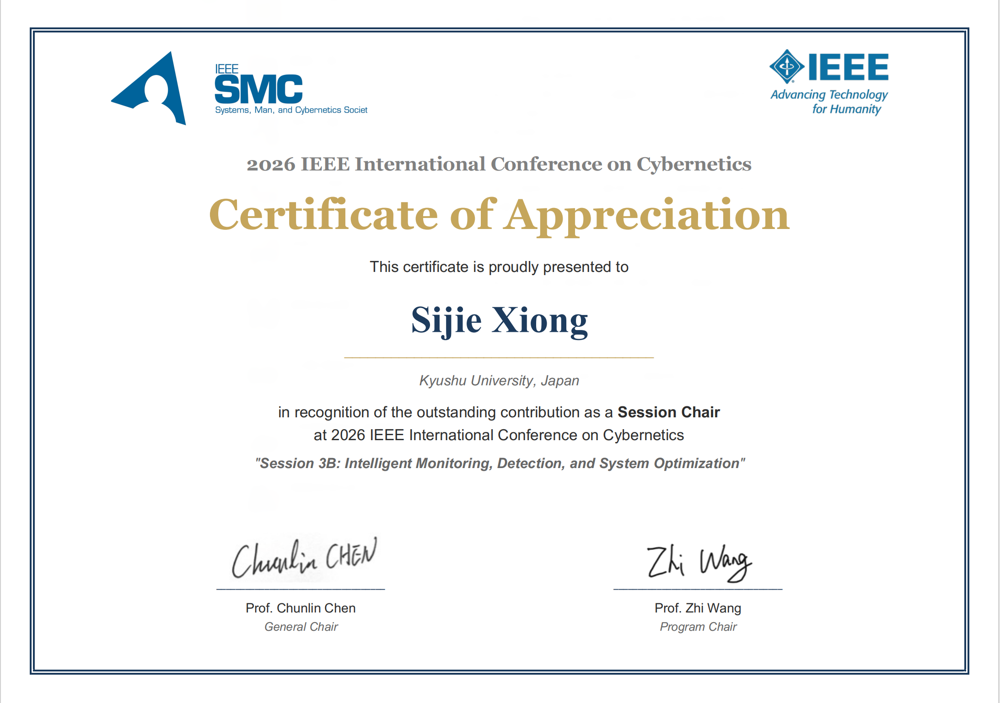
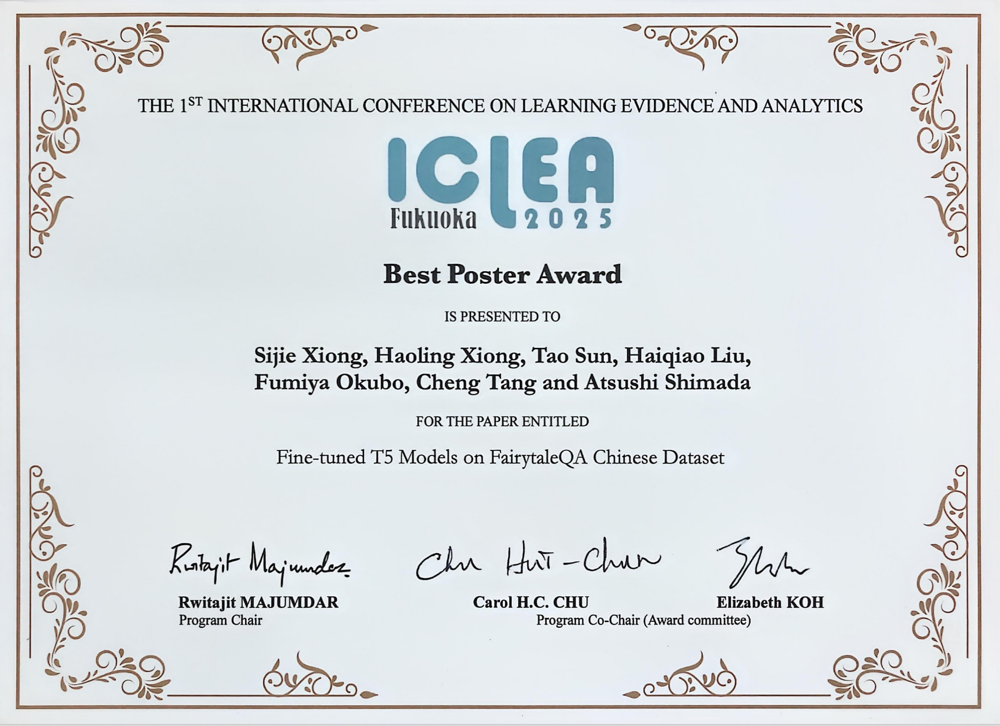

# 🏅 Honors and Awards
- *May 2026* **Worshop 21 Chair** of IEEE PRMVAI 2026 hosted by Hohai University.

- *Apr. 2026* **Session Chair** of IEEE CYBCONF 2026 hosted by Nanjing University.

- *Sep. 2025* **The Best Poster Award** of 2025 International Conference on Learning Evidence and Analytics (**ICLEA**).

- *Oct. 2020* Honorary Title of Learning Model Student (2019-2020), Hohai University. (1st Student in the 4th Academic Year).

- *Oct. 2020* Academic Excellence Scholarship (2019-2020), Hohai University.

- *Oct. 2020* Spiritual Civilization Scholarship (2019-2020), Hohai University.

- *Oct. 2019* Academic Excellence Scholarship (2018-2019), Hohai University.